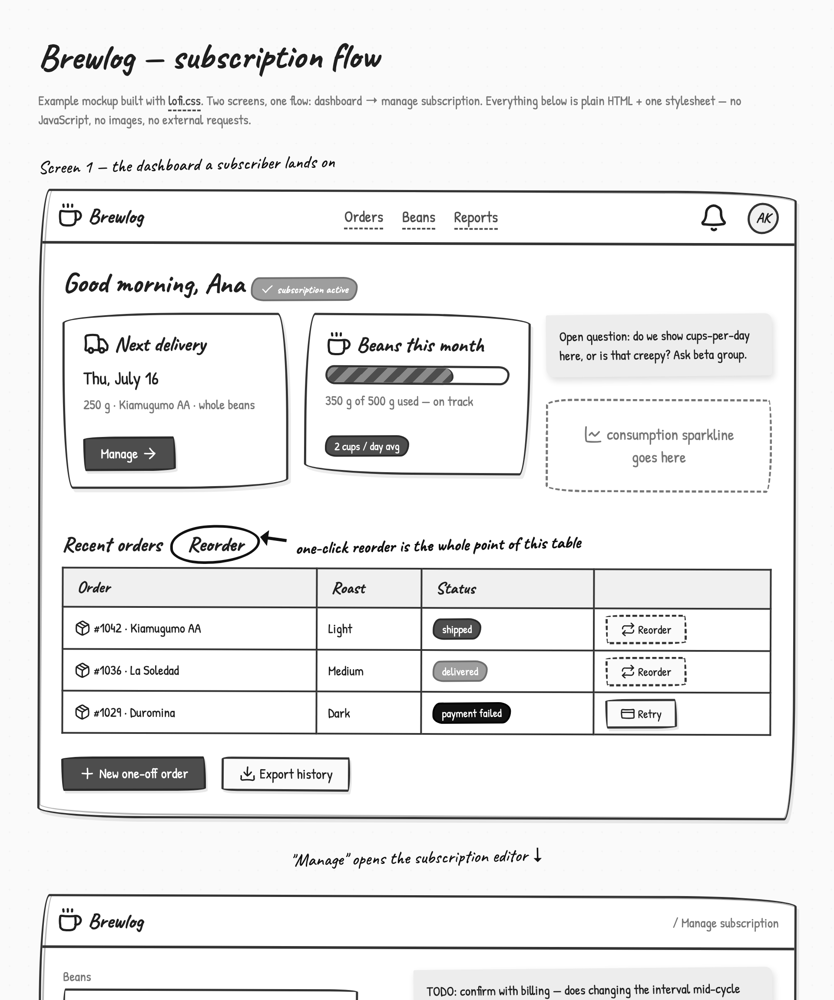

# lofi.css

A tiny hand-drawn wireframe kit in a single CSS file — plus 1,745 scribble icons and a Claude skill.

lofi.css gives plain HTML the paper-scribble look of Excalidraw or tldraw: wobbly borders, marker highlights, squiggly underlines, handwritten fonts. It exists so that lo-fi mockups stay lo-fi — stakeholders discuss **structure and flow**, not visual polish. Grayscale only, no JavaScript, no dependencies, no external requests (the fonts are embedded in the CSS), deliberately imperfect.



The mockup above is [example.html](example.html) — plain semantic HTML plus this one stylesheet. No JavaScript, no images, no build step.

This is a private side project, built in personal time — not affiliated with, or endorsed by, any employer or organization.

**Live demo:** coming soon — until then, clone the repo and open `example.html` (the mockup above) or `lofi-library.html` (the component library) in a browser.

## Why lo-fi, now of all times?

AI made high fidelity cheap. Any idea can be turned into a pixel-perfect, branded, production-looking UI in one prompt — so that's what everyone does, all the time, for everything.

But high fidelity is misleading, precisely because it's no longer earned:

- **Polish reads as certainty.** A finished-looking screen invites finished-level feedback — people debate button colors and spacing on a concept whose *flow* nobody has agreed on yet.
- **It obfuscates where a tool is in its lifecycle.** When the day-one draft and the shipped product look equally done, screenshots stop telling you what's decided, what's a guess, and what's still up for grabs.
- **It makes things specific too early.** Every hifi detail is an implicit decision someone will anchor on, cite, or build against — whether you meant it or not.

lofi.css is the counterweight: a format for **EARLY**. When PMs, engineers, and designers are still figuring out what a thing *is*, the deliberate roughness is information — it says "this is a proposal, argue with the structure, not the styling", and it keeps ideas exactly as unspecific as they actually are.

And it's deliberately **AI-first**: the bundled Claude skill turns websites, feature descriptions, meeting notes, or a photo of a whiteboard scribble into this format in one prompt — with the constraints (grayscale, no polish, no JavaScript, annotations encouraged) enforced by the skill, not by discipline.

## Quick start

1. Copy `lofi.css` next to your HTML file.
2. Add the stylesheet to your `<head>`, and the `lofi` class to `<body>`. The handwriting fonts (Patrick Hand + Caveat) are embedded in the CSS as data URIs — no Google Fonts request, GDPR-friendly by default:

```html
<link rel="stylesheet" href="lofi.css">

<body class="lofi"> ... </body>
```

3. Write plain semantic HTML. Headings, lists, tables, quotes, code, all form elements, `details`, `dialog`, `progress` — everything gets the sketchy treatment with zero classes. The `.lf-*` classes add components on top:

| Purpose | Classes |
|---|---|
| Buttons | `.lf-btn` + `-primary` / `-danger` / `-ghost` |
| Forms | `.lf-input`, `.lf-select`, `.lf-textarea`, `.lf-check`, `.lf-radio`, `.lf-toggle` |
| Containers | `.lf-card`, `.lf-note` (sticky note), `.lf-zone` (dashed region), `.lf-double` |
| Placeholders | `.lf-placeholder` (+`.lf-x`), `.lf-avatar` |
| Status | `.lf-badge`, `.lf-alert`, `.lf-progress` |
| Navigation | `.lf-nav`, `.lf-tabs` + `.lf-tab` |
| Annotation | `.lf-circled`, `.lf-comment`, `.lf-arrow`, `.lf-hl`, `.lf-strike`, `.lf-underline` |
| Layout | `.lf-row`, `.lf-col`, `.lf-stack`, `.lf-border`, `.lf-tilt-l` / `.lf-tilt-r` |

The full component reference with live examples is in `lofi-library.html`.

## Icons


Two sources, one style, one way to use them:

- **Core sprite** — 19 hand-made scribble icons as an inline SVG sprite (see [icons.md](icons.md)). Small enough to paste into any mockup.
- **Full set** — the complete [Lucide](https://lucide.dev) icon catalog (1,745 icons), machine-redrawn in the same wobbly style: jittered anchor points, straight lines bowed into gentle curves, circles redrawn freehand. Ships as [`lofi-icons.svg`](lofi-icons.svg); browse and copy from the searchable gallery in `lofi-icons.html`.

```html
<!-- paste the sprite (or just the <symbol>s you need) once after <body>, then: -->
<svg class="lf-icon"><use href="#lf-i-rocket"/></svg> Launch
```

Icons inherit `currentColor` and scale with the surrounding text. Ids are `lf-i-` + the Lucide name.

### Regenerating the icon set

The conversion is scripted and deterministic (same input → same wobble):

```sh
cd tools
npm install
npm run build-icons   # rewrites lofi-icons.svg, lofi-icons.html, and the skill asset
```

## Deploying the demo site

Everything is static. A ready-to-upload copy of the site lives in [`netlify-drop/`](netlify-drop) — drag that folder onto [Netlify Drop](https://app.netlify.com/drop) and you're live. The site root redirects to the component library (which includes the full icon selector at the bottom); the example mockup is at `/example.html`, the standalone icon gallery at `/lofi-icons.html`.

After changing any source file, refresh the folder with:

```sh
cd tools
npm run build-site   # reassembles netlify-drop/
```

## Claude skill

`lofi-mockups.skill` packages the CSS, both icon sets, and house rules (strictly HTML + lofi.css, grayscale only, no emojis, no JS) so Claude produces consistent mockups from prompts like *"sketch the onboarding flow"*. Install the `.skill` file in Claude, or read the plain source at [lofi-mockups/SKILL.md](lofi-mockups/SKILL.md).

## Repo layout

```
lofi.css               the framework — this is all you need
example.html           example mockup (the screenshot above)
lofi-library.html      component library / documentation
lofi-icons.svg         full icon sprite (1,745 symbols)
lofi-icons.html        searchable icon gallery (click to copy)
icons.md               icon usage reference
lofi-mockups/          Claude skill source (SKILL.md + assets + references)
lofi-mockups.skill     packaged skill (zip)
netlify-drop/          ready-to-upload static site (drag onto Netlify Drop)
tools/                 icon-set generator (Lucide → scribble) + site build
```

## License & credits

- Code and styles: [MIT](LICENSE)
- Icon shapes derived from [Lucide](https://lucide.dev) (ISC license) — scribblified, same grid, same names
- Fonts: [Patrick Hand](https://fonts.google.com/specimen/Patrick+Hand) (© Patrick Wagesreiter) and [Caveat](https://fonts.google.com/specimen/Caveat) (© The Caveat Project Authors), both embedded under the [SIL Open Font License 1.1](https://openfontlicense.org) — no external font loading

Built with help from Claude Fable 5.
